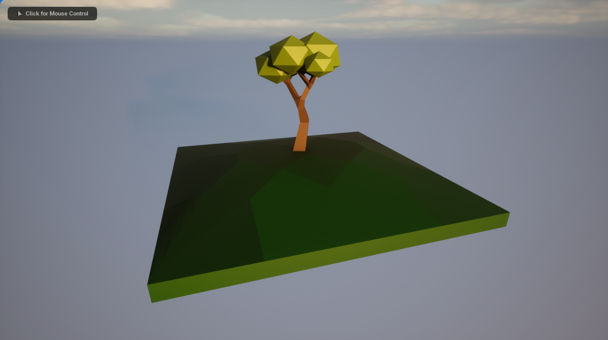
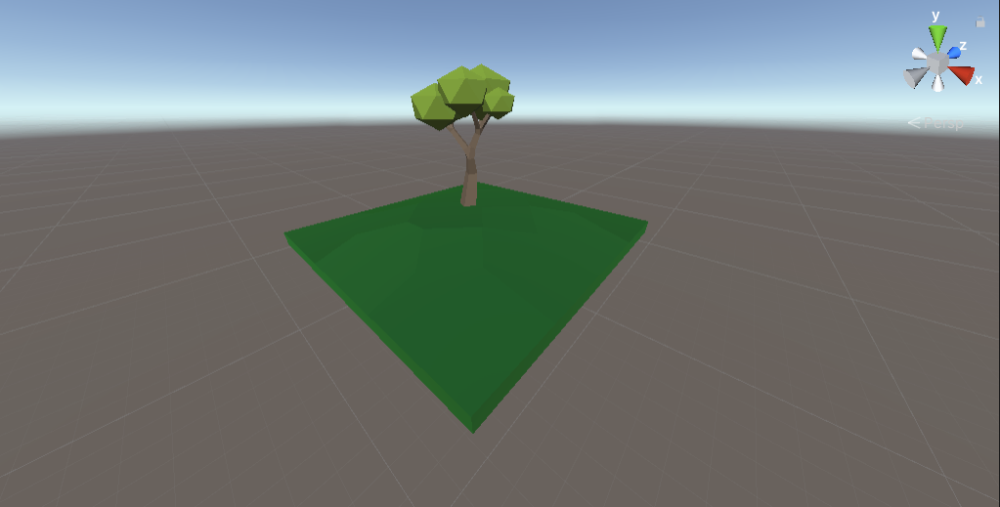

# Présentation des technologies étudiées

- ## LWJGL - ABANDONNÉ
    > ### Langage
    >   * Java
    > ### Points positifs
    >   + Langage étudié en cours
    > ### Points négatifs
    >   - Documentation
    >   - Performances
    >   - Portabilité (JVM)
    >   - Code Only
    >   - Difficile d'utilisation
    > ### Commentaire :
    >   * La technologie n'est pas retenue car la documentation est trop restreinte pour garantir un bon départ sur celle-ci.

- ## ThreeJS - ABANDONNÉ
    > ### Langage
    >   * HTML
    >   * CSS
    >   * Javascript
    >   * Typescript
    > ### Points positifs
    >   + Portabilité
    >   + Facilité d'import des modèles
    > ### Points négatifs
    >   - Performances
    >   - Rendu limité
    >   - Hébergement
    >   - Pas de garde-fou pour l'utilisateur (Rechargement de page)
    > ### Commentaire :
    >   * La technologie n'est pas retenue car le risque d'apparition de problèmes de performances est trop élevé.

- ## Unreal Engine 5
    > ### Langage
    >   * C++
    > ### Points positifs
    >   + Rendu
    >   + Performances (Jeu)
    >   + Documentation
    >   + Assets disponibles
    >   + Compatibilité
    >   + Portabilité
    >   + Versionning facile
    >   + Développement assisté et rapide
    > ### Points négatifs
    >   - Prise en main
    >   - Performances (Editeur)
    > ### Preview :
    >   * 

- ## Unity
    > ### Langage
    >   * C#
    > ### Points positifs
    >   + Praticité
    >   + Performances (Jeu)
    >   + Performances (Editeur)
    >   + Documentation
    >   + Compatibilité
    >   + Portabilité
    > ### Points négatifs
    >   - Langage nouveau
    >   - Prise en main
    >   - Avenir incertain
    > ### Preview :
    >   * 